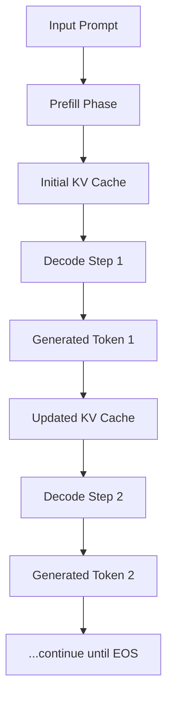

# LLM Inference Basics

## What is LLM Inference?

Large Language Model (LLM) inference is the process of using a pre-trained language model to generate text responses given input prompts. Unlike training, which updates model parameters to learn patterns from data, inference uses fixed model weights to produce outputs through forward passes.

## Training vs Inference: Key Differences

| Aspect | Training | Inference |
|--------|----------|-----------|
| **Purpose** | Learn patterns, update weights | Generate responses using fixed weights |
| **Data Flow** | Batch processing of many examples | Sequential token generation |
| **Memory Pattern** | Temporary activations, gradient storage | Persistent KV cache, minimal working memory |
| **Parallelism** | Data parallel across examples | Tensor parallel within single example |
| **Latency** | High latency acceptable | Low latency critical |
| **Throughput** | Maximize samples/second | Maximize tokens/second |

## The Autoregressive Generation Process

LLMs generate text one token at a time using an autoregressive approach:

```
Input: "The capital of France is"
Step 1: Model processes full prompt → predicts "Paris"
Step 2: Model processes "The capital of France is Paris" → predicts "."  
Step 3: Model processes "The capital of France is Paris." → predicts <EOS>
Output: "Paris."
```

### Why Autoregressive?

1. **Causal Nature**: Each token depends only on previous tokens (causal attention mask)
2. **Variable Length**: Generate sequences of unknown length until stopping condition
3. **High Quality**: Allows model to use full context when generating each token

## Inference Challenges

### 1. Memory Wall Problem
- **KV Cache Growth**: Attention states grow linearly with sequence length
- **Memory Bandwidth**: Moving large KV cache dominates computation time
- **Memory Capacity**: Long sequences may exceed GPU memory

### 2. Computational Inefficiency
- **Small Batch Problem**: Single sequence utilizes only small fraction of GPU
- **Prefill vs Decode**: Two very different computational patterns
- **Memory-Bound Operations**: Attention becomes memory-bound for long sequences

### 3. Latency Requirements
- **Interactive Applications**: Users expect sub-second response times
- **First Token Latency**: Time to first token is critical for user experience
- **Consistent Performance**: Avoid variance in response times

## The Two Phases of Inference

### Prefill Phase (Context Encoding)
- **Process**: Encode the entire input prompt in parallel
- **Computation**: Compute attention for all input tokens simultaneously
- **Memory**: Create initial KV cache entries for input tokens
- **Characteristics**: Compute-bound, good GPU utilization, high parallelism

### Decode Phase (Token Generation) 
- **Process**: Generate one token at a time autoregressively
- **Computation**: Attention over all previous tokens (input + generated)
- **Memory**: Append new KV states to cache, access all previous states
- **Characteristics**: Memory-bound, low GPU utilization, limited parallelism



## Performance Metrics

### Throughput Metrics
- **Tokens/second**: Overall token generation rate
- **Requests/second**: Number of complete requests processed
- **Effective Batch Size**: Average concurrent requests being processed

### Latency Metrics
- **Time to First Token (TTFT)**: Prefill latency
- **Time Between Tokens (TBT)**: Per-token decode latency  
- **End-to-End Latency**: Total request completion time

### Efficiency Metrics
- **GPU Utilization**: Percentage of compute capacity used
- **Memory Utilization**: Percentage of GPU memory used
- **Batching Efficiency**: How well requests are batched together

## Optimization Opportunities

### Memory Optimizations
1. **KV Cache Management**: Efficient storage and retrieval of attention states
2. **Prefix Caching**: Reuse computation for repeated prompt patterns
3. **Memory Layout**: Optimize tensor layouts for access patterns

### Computational Optimizations  
1. **Batching**: Process multiple requests simultaneously
2. **Flash Attention**: Fused attention kernels with reduced memory usage
3. **CUDA Graphs**: Pre-record computation graphs for consistent workloads

### System Optimizations
1. **Tensor Parallelism**: Distribute computation across multiple GPUs
2. **Pipeline Parallelism**: Overlap computation stages
3. **Speculative Decoding**: Use draft models to accelerate generation

## Real-World Considerations

### User Experience
- **Streaming**: Show tokens as they're generated (streaming response)
- **Cancellation**: Allow users to stop long-running requests
- **Fair Scheduling**: Prevent large requests from blocking small ones

### Resource Management
- **Memory Limits**: Handle out-of-memory gracefully with preemption
- **Load Balancing**: Distribute requests across available resources
- **Auto-scaling**: Adjust capacity based on demand

### Quality vs Performance Trade-offs
- **Sampling Parameters**: Temperature affects both quality and cacheability
- **Max Length Limits**: Balance user needs with resource constraints
- **Batching Delays**: Small delays can significantly improve throughput

## Key Takeaways

1. **Two-Phase Nature**: Prefill and decode phases have very different characteristics
2. **Memory Dominance**: Memory management is often more important than raw compute
3. **Batching is Critical**: Single request inference is extremely inefficient
4. **System Complexity**: Production inference engines are sophisticated systems
5. **Trade-offs Everywhere**: Every optimization involves trade-offs between metrics

Understanding these fundamentals is essential before diving into implementation details. The next sections will explore how real inference engines address these challenges through sophisticated memory management, scheduling algorithms, and optimization techniques.