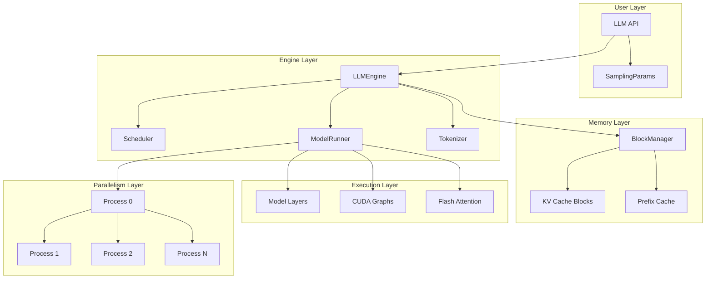

# Engine Architecture Overview

## High-Level Architecture

nano-vLLM follows a layered architecture pattern with clear separation of concerns:



## Core Components

### 1. API Layer (`nanovllm/llm.py`)

The simplest layer - just a facade over LLMEngine:

```python
class LLM(LLMEngine):
    """High-level API for LLM inference"""
    def __init__(self, model, **kwargs):
        super().__init__(model, **kwargs)
        
    def generate(self, prompts, sampling_params):
        return super().generate(prompts, sampling_params)
```

**Design Pattern**: Facade Pattern
- Provides clean, simple interface
- Hides internal complexity
- Allows for future API evolution without breaking changes

### 2. Engine Orchestration (`nanovllm/engine/llm_engine.py`)

The central coordinator that manages all subsystems:

```python
class LLMEngine:
    def __init__(self, model, **kwargs):
        # 1. Configuration setup
        config = Config(model, **kwargs)
        
        # 2. Multi-process setup for tensor parallelism
        self.ps = []  # Worker processes
        self.events = []  # Synchronization events
        ctx = mp.get_context("spawn")
        
        for i in range(1, config.tensor_parallel_size):
            event = ctx.Event()
            process = ctx.Process(target=ModelRunner, args=(config, i, event))
            process.start()
            self.ps.append(process)
            self.events.append(event)
            
        # 3. Initialize main components
        self.model_runner = ModelRunner(config, rank=0, events=self.events)
        self.tokenizer = AutoTokenizer.from_pretrained(config.model)
        self.scheduler = Scheduler(config)
```

**Key Responsibilities**:
1. **Process Management**: Spawn and coordinate tensor parallel workers
2. **Component Initialization**: Set up scheduler, model runner, tokenizer
3. **Request Orchestration**: Coordinate request lifecycle from input to output
4. **Performance Monitoring**: Track throughput metrics and timing

### 3. Request Lifecycle Management

```python
def generate(self, prompts, sampling_params):
    # Phase 1: Request preparation
    for prompt, sp in zip(prompts, sampling_params):
        self.add_request(prompt, sp)
    
    # Phase 2: Execution loop  
    while self.scheduler.has_pending_requests():
        self.step()
    
    # Phase 3: Output collection
    outputs = self.scheduler.get_completed_outputs()
    return self.format_outputs(outputs)
    
def step(self):
    # Core execution step
    seqs, is_prefill = self.scheduler.schedule()  # Decide what to run
    token_ids = self.model_runner.call("run", seqs, is_prefill)  # Execute model
    self.scheduler.postprocess(seqs, token_ids, is_prefill)  # Update state
```

## Memory Architecture

### Block-Based Memory Management

nano-vLLM uses a sophisticated block-based memory system inspired by virtual memory:

```python
# Memory is organized as fixed-size blocks
BLOCK_SIZE = 256  # tokens per block
NUM_BLOCKS = total_gpu_memory // (block_size * kv_cache_element_size)

# Each sequence has a block table (like a page table)
sequence_block_tables = {
    seq_id_1: [physical_block_7, physical_block_12, physical_block_3],
    seq_id_2: [physical_block_15, physical_block_8],
    seq_id_3: [physical_block_7, physical_block_23]  # Note: shares block 7!
}

# Global block pool
free_blocks = [0, 1, 2, 4, 5, 6, 9, 10, 11, ...]
allocated_blocks = {7: [seq_1, seq_3], 8: [seq_2], 12: [seq_1], ...}
```

### Content-Based Sharing

The most innovative aspect is content-based block sharing:

```python
def allocate_block(self, token_sequence):
    # Hash the actual token content  
    content_hash = xxhash.xxh64(' '.join(map(str, token_sequence))).hexdigest()
    
    if content_hash in self.content_hash_to_block:
        # Reuse existing block with identical content
        block_id = self.content_hash_to_block[content_hash]
        self.block_ref_count[block_id] += 1
        return block_id
    else:
        # Allocate new block
        block_id = self.free_blocks.pop()
        self.content_hash_to_block[content_hash] = block_id
        self.block_ref_count[block_id] = 1
        return block_id
```

**Benefits**:
- **Automatic Deduplication**: Identical content shares memory
- **Reference Counting**: Automatic cleanup when sequences complete
- **Prefix Sharing**: Common system prompts use minimal memory
- **Zero Overhead**: Hash lookup is O(1) and very fast

## Process Architecture

### Multi-Process Tensor Parallelism

```python
# Main process (rank 0)
class LLMEngine:
    def __init__(self):
        # Spawn worker processes for ranks 1, 2, ..., N-1
        for rank in range(1, tensor_parallel_size):
            process = Process(target=ModelRunner, args=(config, rank))
            process.start()
            
        # Main process handles rank 0
        self.model_runner = ModelRunner(config, rank=0)

# Worker processes (ranks 1+)  
class ModelRunner:
    def __init__(self, config, rank):
        self.rank = rank
        self.model = self.load_model_partition(config, rank)
        
        if rank > 0:
            # Worker process: wait for commands from main process
            while True:
                command = self.receive_command()
                result = self.execute_command(command)
                self.send_result(result)
```

### Inter-Process Communication

```python
class ModelRunner:
    def call(self, method_name, *args, **kwargs):
        if self.rank == 0:
            # Main process: broadcast to all workers
            for event in self.events:
                event.set()  # Signal workers to execute
                
            # Execute on main process  
            local_result = getattr(self, method_name)(*args, **kwargs)
            
            # Wait for workers to complete (implicit synchronization)
            return local_result
        else:
            # Worker process: execute when signaled
            return getattr(self, method_name)(*args, **kwargs)
```

**Design Trade-offs**:
- **Pros**: Simple, reliable, process isolation
- **Cons**: Higher memory usage (each process loads model), serialization overhead
- **Alternative**: Shared memory or distributed frameworks (more complex)

## Scheduling Architecture

### Two-Phase Scheduling

nano-vLLM uses distinct scheduling for prefill and decode phases:

```python
class Scheduler:
    def schedule(self):
        # Phase 1: Try to schedule prefill requests
        if self.waiting_requests:
            batch, is_prefill = self.schedule_prefill()
            if batch:
                return batch, is_prefill
                
        # Phase 2: Schedule decode requests
        if self.running_requests:
            batch, is_prefill = self.schedule_decode()
            return batch, is_prefill
            
        return [], False  # Nothing to schedule
```

### Memory-Aware Scheduling

```python
def schedule_prefill(self):
    batch = []
    total_tokens = 0
    total_seqs = 0
    
    for request in self.waiting_requests:
        # Check token limit
        if total_tokens + len(request.tokens) > self.max_num_batched_tokens:
            break
            
        # Check sequence limit  
        if total_seqs + 1 > self.max_num_seqs:
            break
            
        # Check memory availability
        blocks_needed = self.block_manager.get_num_free_blocks()
        if blocks_needed < self.estimate_blocks_needed(request):
            break
            
        batch.append(request)
        total_tokens += len(request.tokens)
        total_seqs += 1
        
    return batch, True  # is_prefill = True
```

### Preemption Support

```python
def handle_memory_pressure(self):
    # When memory is full, preempt running sequences
    # Use LIFO (Last In, First Out) policy
    
    while (self.block_manager.get_num_free_blocks() < self.min_free_blocks and 
           self.running_requests):
        
        # Preempt most recently started request
        victim_request = self.running_requests.pop()  # LIFO
        
        # Free its memory blocks
        self.block_manager.free_sequence_blocks(victim_request.seq_id)
        
        # Move back to waiting queue
        self.waiting_requests.appendleft(victim_request)
        victim_request.reset_to_waiting_state()
```

## Model Execution Architecture

### Modular Layer Design

```python
# Each model component is independently replaceable
class Qwen3Model(nn.Module):
    def __init__(self, config):
        # Embedding layer
        self.embed_tokens = VocabParallelEmbedding(
            config.vocab_size, config.hidden_size
        )
        
        # Transformer layers
        self.layers = nn.ModuleList([
            Qwen3DecoderLayer(config) for _ in range(config.num_hidden_layers)
        ])
        
        # Output normalization  
        self.norm = RMSNorm(config.hidden_size)

class Qwen3DecoderLayer(nn.Module):
    def __init__(self, config):
        # Self-attention with tensor parallelism
        self.self_attn = Qwen3Attention(config)
        
        # Feed-forward network with tensor parallelism
        self.mlp = Qwen3MLP(config)
        
        # Layer normalization
        self.input_layernorm = RMSNorm(config.hidden_size)
        self.post_attention_layernorm = RMSNorm(config.hidden_size)
```

### Execution Optimization

```python
class ModelRunner:
    def run(self, seqs, is_prefill):
        # Prepare execution context
        context = self.prepare_context(seqs, is_prefill)
        
        # Choose execution path based on phase and batch size
        if is_prefill:
            return self.prefill_forward(seqs, context)
        else:
            # Try CUDA graph first for decode
            if self.can_use_cuda_graph(seqs):
                return self.cuda_graph_forward(seqs, context)
            else:
                return self.eager_forward(seqs, context)
```

## Performance Monitoring

### Comprehensive Metrics

```python
class PerformanceTracker:
    def __init__(self):
        self.prefill_throughput = ThroughputCalculator()
        self.decode_throughput = ThroughputCalculator()
        self.memory_usage = MemoryTracker()
        self.request_latencies = LatencyTracker()
        
    def log_step_performance(self, seqs, is_prefill, step_time):
        if is_prefill:
            tokens = sum(len(seq.prompt_tokens) for seq in seqs)
            self.prefill_throughput.add_sample(tokens, step_time)
        else:
            tokens = len(seqs)  # One token per sequence in decode
            self.decode_throughput.add_sample(tokens, step_time)
            
        self.memory_usage.update()
        
    def print_stats(self):
        print(f"Prefill: {self.prefill_throughput.get_throughput():.2f} tokens/s")
        print(f"Decode: {self.decode_throughput.get_throughput():.2f} tokens/s") 
        print(f"Memory: {self.memory_usage.get_utilization():.1f}%")
```

## Design Principles

### 1. Separation of Concerns
- **LLMEngine**: Orchestration and process management
- **Scheduler**: Request scheduling and memory management  
- **ModelRunner**: Model execution and optimization
- **BlockManager**: Memory allocation and sharing

### 2. Extensibility
- **Pluggable Schedulers**: Easy to experiment with different scheduling algorithms
- **Multiple Model Support**: Architecture supports different model families
- **Optimization Modules**: CUDA graphs, Flash Attention are modular

### 3. Robustness
- **Process Isolation**: Worker process crashes don't affect main process
- **Memory Safety**: Block-based allocation prevents fragmentation
- **Graceful Degradation**: Falls back to eager execution when CUDA graphs fail

### 4. Performance First
- **Zero-Copy Operations**: Minimize data copying between components
- **Batching Everywhere**: Every operation is designed for batched execution
- **Memory Efficiency**: Aggressive sharing and deduplication

## Key Architectural Decisions

### Multi-Process vs Multi-Threading
**Decision**: Multi-process tensor parallelism
**Rationale**: 
- Python GIL limitations for multi-threading
- Process isolation improves robustness
- Easier debugging and profiling
- Trade-off: Higher memory usage

### Block-Based Memory Management  
**Decision**: Fixed-size blocks with content-based sharing
**Rationale**:
- Eliminates memory fragmentation
- Enables efficient prefix sharing
- Simplified memory accounting
- Trade-off: Some internal fragmentation within blocks

### Two-Phase Scheduling
**Decision**: Separate prefill and decode scheduling  
**Rationale**:
- Different phases have different characteristics
- Enables phase-specific optimizations
- Clearer performance reasoning
- Trade-off: More complex scheduling logic

## Comparison to Other Architectures

### vs Traditional Serving (like Transformers)
- **nano-vLLM**: Continuous batching, block-based memory, multi-GPU
- **Traditional**: Request-level batching, simple memory, single-GPU
- **Performance Gap**: 10-100x difference in production throughput

### vs Original vLLM
- **Similarities**: Block manager concept, Flash Attention, scheduling approach
- **Differences**: Simplified codebase, different parallelism implementation, fewer features
- **Trade-offs**: nano-vLLM prioritizes simplicity and readability over feature completeness

This architecture provides the foundation for understanding how modern LLM inference engines achieve high performance while maintaining code clarity and extensibility. The next sections will dive deeper into each component's implementation details.