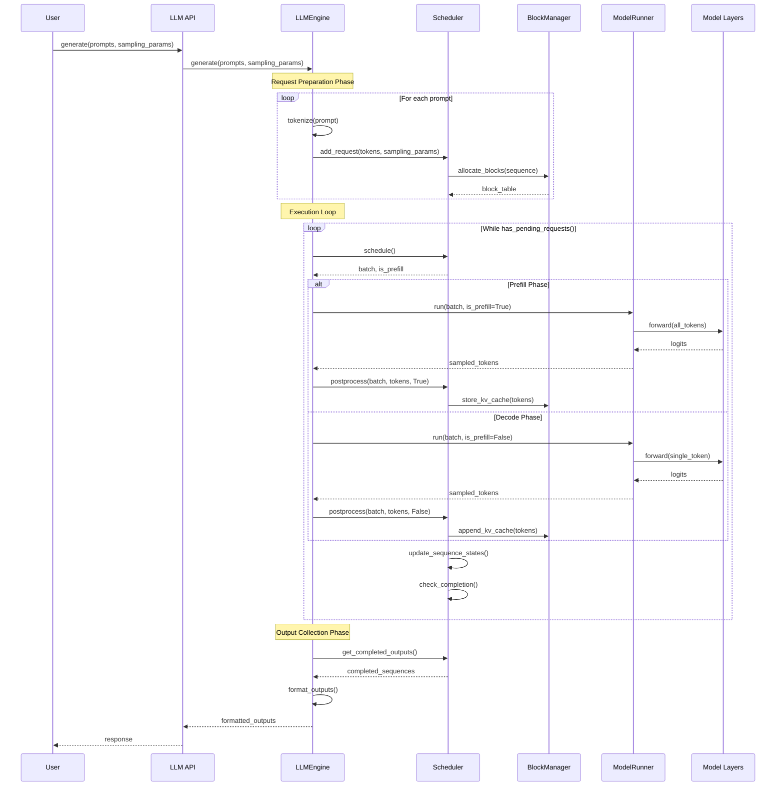

# Request Lifecycle: From Prompt to Completion

## Overview

Understanding the complete journey of a request through nano-vLLM is crucial for building your own inference engine. This document traces a request from initial input through final output, showing how all components work together.

## Complete Request Flow Diagram



## Phase-by-Phase Deep Dive

### Phase 1: Request Preparation

#### Step 1.1: Tokenization
```python
def add_request(self, prompt: str | list[int], sampling_params: SamplingParams):
    # Convert string to tokens if needed
    if isinstance(prompt, str):
        prompt = self.tokenizer.encode(prompt)
        
    # Create sequence object to track request state
    seq = Sequence(prompt, sampling_params)
    
    # Add to scheduler's waiting queue
    self.scheduler.add(seq)
```

**Key Operations**:
- **Text → Tokens**: Convert human-readable text to model token IDs
- **Sequence Creation**: Wrap tokens with metadata (sampling params, state)
- **Queue Addition**: Add to scheduler's waiting queue for processing

#### Step 1.2: Memory Allocation
```python
class Scheduler:
    def add(self, seq: Sequence):
        # Estimate memory requirements
        initial_blocks = (len(seq.prompt_tokens) + self.block_size - 1) // self.block_size
        max_blocks = (seq.max_tokens + self.block_size - 1) // self.block_size
        
        # Try to allocate blocks (may fail if out of memory)
        try:
            block_table = self.block_manager.allocate(seq.seq_id, initial_blocks)
            seq.block_table = block_table
            self.waiting.append(seq)
        except OutOfMemoryError:
            self.rejected_requests.append(seq)
```

**Memory Allocation Strategy**:
1. **Conservative Estimation**: Allocate based on prompt length initially
2. **Dynamic Growth**: Allocate additional blocks as sequence grows
3. **Prefix Cache Lookup**: Check for shareable blocks before allocation
4. **Fallback Handling**: Queue request if memory unavailable

#### Step 1.3: Prefix Cache Optimization
```python
def allocate_with_prefix_cache(self, seq_id, tokens):
    block_table = []
    
    # Process tokens in block-sized chunks
    for block_start in range(0, len(tokens), self.block_size):
        block_end = min(block_start + self.block_size, len(tokens))
        block_tokens = tokens[block_start:block_end]
        
        # Check if this block content already exists
        content_hash = self.compute_hash(block_tokens)
        
        if content_hash in self.content_hash_to_block:
            # Reuse existing block
            block_id = self.content_hash_to_block[content_hash]
            self.block_ref_count[block_id] += 1
            block_table.append(block_id)
        else:
            # Allocate new block
            block_id = self.allocate_new_block()
            self.populate_block(block_id, block_tokens)
            self.content_hash_to_block[content_hash] = block_id
            self.block_ref_count[block_id] = 1
            block_table.append(block_id)
            
    return block_table
```

### Phase 2: Prefill Execution

#### Step 2.1: Prefill Scheduling
```python
def schedule_prefill(self):
    """Select requests for prefill batch considering constraints"""
    batch = []
    total_tokens = 0
    total_seqs = 0
    
    for seq in self.waiting:
        prompt_len = len(seq.prompt_tokens)
        
        # Check batching constraints
        if (total_tokens + prompt_len > self.max_num_batched_tokens or
            total_seqs + 1 > self.max_num_seqs):
            break
            
        # Check memory availability  
        if not self.block_manager.can_allocate(seq.seq_id):
            # Try preemption to free memory
            if not self.try_preemption():
                break
                
        batch.append(seq)
        total_tokens += prompt_len
        total_seqs += 1
        
        # Move from waiting to running
        seq.status = SequenceStatus.RUNNING
        
    return batch, True  # is_prefill=True
```

#### Step 2.2: Context Preparation for Prefill
```python
def prepare_prefill_context(self, seqs):
    """Prepare Flash Attention inputs for variable-length sequences"""
    
    # Concatenate all prompt tokens
    all_tokens = []
    cu_seqlens = [0]  # Cumulative sequence lengths
    
    for seq in seqs:
        all_tokens.extend(seq.prompt_tokens)
        cu_seqlens.append(cu_seqlens[-1] + len(seq.prompt_tokens))
        
    # Prepare slot mapping for KV cache storage
    slot_mapping = []
    for seq in seqs:
        for token_pos in range(len(seq.prompt_tokens)):
            block_idx = token_pos // self.block_size
            within_block_pos = token_pos % self.block_size
            physical_block = seq.block_table[block_idx]
            slot = physical_block * self.block_size + within_block_pos
            slot_mapping.append(slot)
    
    return {
        'tokens': torch.tensor(all_tokens),
        'cu_seqlens': torch.tensor(cu_seqlens),
        'slot_mapping': torch.tensor(slot_mapping),
        'max_seqlen': max(len(seq.prompt_tokens) for seq in seqs)
    }
```

#### Step 2.3: Prefill Model Execution
```python
def prefill_forward(self, seqs, context):
    """Execute model forward pass for prefill phase"""
    
    # Get input embeddings
    input_ids = context['tokens']
    hidden_states = self.model.embed_tokens(input_ids)
    
    # Process through all transformer layers
    for layer in self.model.layers:
        hidden_states = layer(
            hidden_states,
            cu_seqlens=context['cu_seqlens'],
            max_seqlen=context['max_seqlen'],
            kv_cache=self.kv_cache,
            slot_mapping=context['slot_mapping']
        )
    
    # Apply final layer norm and get logits
    hidden_states = self.model.norm(hidden_states)
    
    # Only need logits for last token of each sequence
    last_token_indices = [cu_seqlen - 1 for cu_seqlen in context['cu_seqlens'][1:]]
    last_hidden_states = hidden_states[last_token_indices]
    logits = self.model.lm_head(last_hidden_states)
    
    # Sample next tokens
    return self.sampler.sample(logits, [seq.sampling_params for seq in seqs])
```

#### Step 2.4: KV Cache Population
```python
def store_kv_cache(self, layer_idx, key_states, value_states, slot_mapping):
    """Store computed K, V states in block-based cache"""
    
    # Get cache tensors for this layer
    key_cache = self.kv_caches[layer_idx]['key']    # [num_blocks, block_size, num_kv_heads, head_dim]
    value_cache = self.kv_caches[layer_idx]['value'] # [num_blocks, block_size, num_kv_heads, head_dim]
    
    # Custom CUDA kernel for efficient storage
    self.kv_store_kernel(
        key_cache,
        value_cache,
        key_states,      # [num_tokens, num_kv_heads, head_dim]
        value_states,    # [num_tokens, num_kv_heads, head_dim]
        slot_mapping     # [num_tokens] - where to store each token
    )
```

### Phase 3: Decode Execution Loop

#### Step 3.1: Decode Scheduling
```python
def schedule_decode(self):
    """Select running sequences for decode batch"""
    
    # All running sequences can be batched together for decode
    # Each generates exactly one token
    batch = list(self.running)
    
    # Check if we have enough memory for new tokens
    blocks_needed = sum(seq.needs_new_block() for seq in batch)
    if blocks_needed > self.block_manager.get_num_free_blocks():
        # Preempt some sequences to free memory
        batch = self.preempt_sequences(batch, blocks_needed)
        
    return batch, False  # is_prefill=False
```

#### Step 3.2: Context Preparation for Decode
```python
def prepare_decode_context(self, seqs):
    """Prepare inputs for single-token generation"""
    
    # Input is the last generated token for each sequence
    input_tokens = [seq.get_last_token() for seq in seqs]
    
    # Slot mapping for new token storage
    slot_mapping = []
    for seq in seqs:
        next_pos = len(seq.all_tokens)  # Position for new token
        block_idx = next_pos // self.block_size
        
        # Allocate new block if needed
        if block_idx >= len(seq.block_table):
            new_block = self.block_manager.allocate_block()
            seq.block_table.append(new_block)
            
        within_block_pos = next_pos % self.block_size
        physical_block = seq.block_table[block_idx]
        slot = physical_block * self.block_size + within_block_pos
        slot_mapping.append(slot)
    
    # Block tables for attention computation
    block_tables = [seq.block_table for seq in seqs]
    context_lens = [len(seq.all_tokens) for seq in seqs]
    
    return {
        'tokens': torch.tensor(input_tokens),
        'slot_mapping': torch.tensor(slot_mapping),
        'block_tables': block_tables,
        'context_lens': torch.tensor(context_lens)
    }
```

#### Step 3.3: CUDA Graph Optimization
```python
def cuda_graph_forward(self, seqs, context):
    """Use pre-captured CUDA graph for decode"""
    
    batch_size = len(seqs)
    max_context_len = max(context['context_lens'])
    
    # Check if we have a captured graph for this configuration
    graph_key = (batch_size, max_context_len)
    if graph_key not in self.cuda_graphs:
        # Capture new graph
        self.capture_cuda_graph(graph_key)
    
    # Update input tensors in-place (required for CUDA graphs)
    self.graph_input_tokens.copy_(context['tokens'])
    self.graph_slot_mapping.copy_(context['slot_mapping'])
    self.update_block_tables(context['block_tables'])
    
    # Replay captured graph
    graph = self.cuda_graphs[graph_key]
    graph.replay()
    
    # Return output from graph execution
    return self.graph_output_tokens.clone()
```

#### Step 3.4: Flash Attention for Decode
```python
def decode_attention(self, query, key_cache, value_cache, block_tables, context_lens):
    """Attention computation using cached K, V values"""
    
    # Flash Attention with KV cache
    output = flash_attn_with_kvcache(
        query,                    # [batch_size, num_heads, head_dim]
        key_cache,               # [num_blocks, block_size, num_kv_heads, head_dim]  
        value_cache,             # [num_blocks, block_size, num_kv_heads, head_dim]
        cache_seqlens=context_lens,  # [batch_size] - how many tokens in cache
        block_table=block_tables     # [batch_size, max_blocks] - block mapping
    )
    
    return output
```

### Phase 4: Completion Detection and Output Processing

#### Step 4.1: Sequence State Updates
```python
def postprocess(self, seqs, sampled_tokens, is_prefill):
    """Update sequence states after token generation"""
    
    for seq, token in zip(seqs, sampled_tokens):
        # Add new token to sequence
        seq.append_token(token)
        
        # Check completion conditions
        if (token == self.tokenizer.eos_token_id and 
            not seq.sampling_params.ignore_eos):
            seq.status = SequenceStatus.FINISHED_EOS
        elif len(seq.completion_tokens) >= seq.sampling_params.max_tokens:
            seq.status = SequenceStatus.FINISHED_LENGTH
        else:
            seq.status = SequenceStatus.RUNNING
            
        # Update metrics
        if is_prefill:
            seq.metrics.first_token_time = time.time()
        else:
            seq.metrics.last_token_time = time.time()
```

#### Step 4.2: Memory Cleanup
```python
def cleanup_finished_sequences(self):
    """Clean up memory for completed sequences"""
    
    finished_seqs = [seq for seq in self.running if seq.is_finished()]
    
    for seq in finished_seqs:
        # Free KV cache blocks
        self.block_manager.free_sequence_blocks(seq.seq_id)
        
        # Move to completed queue
        self.completed.append(seq)
        self.running.remove(seq)
        
        # Update performance metrics
        self.metrics.record_completion(seq)
```

#### Step 4.3: Output Formatting
```python
def format_outputs(self, completed_sequences):
    """Convert completed sequences to user-friendly format"""
    
    outputs = []
    for seq in completed_sequences:
        # Decode tokens to text
        completion_text = self.tokenizer.decode(seq.completion_tokens)
        
        output = {
            'text': completion_text,
            'token_ids': seq.completion_tokens,
            'finish_reason': seq.get_finish_reason(),
            'usage': {
                'prompt_tokens': len(seq.prompt_tokens),
                'completion_tokens': len(seq.completion_tokens),
                'total_tokens': len(seq.all_tokens)
            },
            'metrics': {
                'time_to_first_token': seq.metrics.time_to_first_token(),
                'inter_token_latency': seq.metrics.inter_token_latency(),
                'total_time': seq.metrics.total_time()
            }
        }
        outputs.append(output)
        
    return outputs
```

## Error Handling and Edge Cases

### Out of Memory Handling
```python
def handle_out_of_memory(self, failed_sequences):
    """Handle memory exhaustion gracefully"""
    
    # Try preemption first
    if self.try_preemption():
        # Retry failed sequences
        for seq in failed_sequences:
            self.waiting.appendleft(seq)  # High priority retry
        return
        
    # If preemption fails, reject requests
    for seq in failed_sequences:
        seq.status = SequenceStatus.FINISHED_ABORT
        seq.error_message = "Insufficient memory"
        self.completed.append(seq)
```

### Sequence Preemption
```python
def try_preemption(self):
    """Preempt running sequences to free memory"""
    
    if not self.running:
        return False
        
    # LIFO preemption (preempt most recently started)
    victim = self.running.pop()  
    
    # Free victim's memory
    self.block_manager.free_sequence_blocks(victim.seq_id)
    
    # Reset victim to waiting state
    victim.reset_for_recomputation()
    self.waiting.appendleft(victim)
    
    return True
```

## Performance Characteristics by Phase

### Prefill Phase
- **Characteristics**: Compute-bound, high parallelism, good GPU utilization
- **Bottlenecks**: Memory bandwidth for very long sequences
- **Optimizations**: Flash Attention, sequence packing, tensor parallelism

### Decode Phase  
- **Characteristics**: Memory-bound, low parallelism, poor GPU utilization
- **Bottlenecks**: KV cache memory bandwidth, small batch sizes
- **Optimizations**: CUDA graphs, larger batches, prefix caching

### Transition Costs
- **Context Switching**: Minimal due to shared memory design
- **Graph Switching**: Small overhead for CUDA graph selection
- **Memory Allocation**: Amortized through block reuse

## Key Takeaways

1. **Two-Phase Design**: Prefill and decode phases require different optimizations
2. **Memory-First Architecture**: Memory management drives most design decisions
3. **Batching is Critical**: Every operation is designed for efficient batching
4. **Graceful Degradation**: System handles memory pressure through preemption
5. **Performance Monitoring**: Comprehensive metrics throughout the pipeline
6. **State Management**: Complex state tracking ensures correctness

Understanding this request lifecycle is essential for implementing your own inference engine. Each phase presents different challenges and optimization opportunities, and the transitions between phases must be carefully managed for optimal performance.