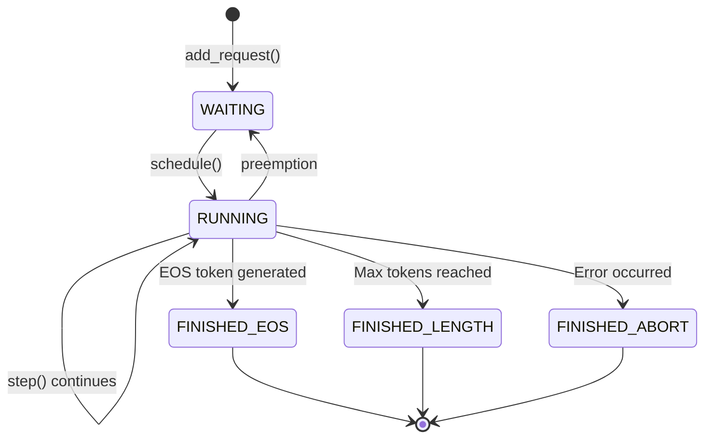

# Scheduler: The Brain of Request Management

## Overview

The Scheduler (`nanovllm/engine/scheduler.py`) is the intelligent request management system that decides which requests to process, when to process them, and how to handle memory constraints. It implements sophisticated algorithms for batching, scheduling, and preemption.

## Core Responsibilities

1. **Request Queuing**: Manage waiting, running, and completed request queues
2. **Batch Formation**: Create optimal batches considering various constraints
3. **Memory Management**: Work with BlockManager to allocate and free memory
4. **Preemption**: Handle memory pressure by temporarily pausing requests
5. **Performance Optimization**: Maximize throughput while minimizing latency

## Architecture Overview

```python
class Scheduler:
    def __init__(self, config):
        self.config = config
        
        # Request queues
        self.waiting = deque()      # Requests waiting to be processed
        self.running = deque()      # Currently processing requests
        self.completed = deque()    # Finished requests
        
        # Memory management
        self.block_manager = BlockManager(config)
        
        # Scheduling constraints
        self.max_num_batched_tokens = config.max_num_batched_tokens
        self.max_num_seqs = config.max_num_seqs
```

## Request State Management

### Sequence Status Lifecycle

```python
class SequenceStatus(enum.Enum):
    WAITING = "waiting"           # In waiting queue
    RUNNING = "running"           # Being processed
    FINISHED_EOS = "finished_eos" # Completed with EOS token
    FINISHED_LENGTH = "finished_length"  # Reached max length
    FINISHED_ABORT = "finished_abort"    # Aborted due to error
```

### State Transitions



## Batch Scheduling Algorithms

### Two-Phase Scheduling Strategy

The scheduler uses separate algorithms for prefill and decode phases:

```python
def schedule(self):
    """Main scheduling entry point"""
    
    # Phase 1: Try prefill scheduling (higher priority)
    if self.waiting:
        batch, is_prefill = self.schedule_prefill()
        if batch:
            return batch, is_prefill
    
    # Phase 2: Try decode scheduling
    if self.running:
        batch, is_prefill = self.schedule_decode()
        return batch, is_prefill
    
    return [], False  # Nothing to schedule
```

### Prefill Scheduling Algorithm

Prefill scheduling packs variable-length sequences into batches:

```python
def schedule_prefill(self):
    """Schedule prefill requests with constraint satisfaction"""
    
    batch = []
    total_tokens = 0
    total_seqs = 0
    
    # Try to add requests while satisfying constraints
    candidates = list(self.waiting)  # Copy to avoid modification during iteration
    
    for seq in candidates:
        prompt_len = len(seq.prompt_tokens)
        
        # Constraint 1: Token budget
        if total_tokens + prompt_len > self.max_num_batched_tokens:
            continue
            
        # Constraint 2: Sequence count limit
        if total_seqs + 1 > self.max_num_seqs:
            break  # No more sequences can fit
        
        # Constraint 3: Memory availability
        blocks_needed = self.estimate_blocks_needed(seq)
        if not self.can_allocate_blocks(blocks_needed):
            # Try preemption to free memory
            if self.try_preemption_for_request(seq):
                # Retry after preemption
                if not self.can_allocate_blocks(blocks_needed):
                    continue  # Still can't allocate
            else:
                continue  # Preemption failed
        
        # All constraints satisfied - add to batch
        batch.append(seq)
        total_tokens += prompt_len
        total_seqs += 1
        
        # Allocate memory blocks
        try:
            self.block_manager.allocate(seq.seq_id, blocks_needed)
        except OutOfMemoryError:
            # This shouldn't happen due to checks above
            batch.pop()
            total_tokens -= prompt_len
            total_seqs -= 1
            continue
        
        # Move from waiting to running
        seq.status = SequenceStatus.RUNNING
        self.waiting.remove(seq)
        self.running.append(seq)
    
    return batch, True if batch else ([], False)
```

### Decode Scheduling Algorithm

Decode scheduling is simpler since all running sequences can typically be batched:

```python
def schedule_decode(self):
    """Schedule decode requests (typically all running sequences)"""
    
    if not self.running:
        return [], False
    
    # Start with all running sequences
    batch = list(self.running)
    
    # Check memory constraints for new tokens
    memory_needed = sum(1 for seq in batch if seq.needs_new_block())
    available_blocks = self.block_manager.get_num_free_blocks()
    
    if memory_needed > available_blocks:
        # Need to preempt some sequences
        batch = self.preempt_for_decode(batch, memory_needed - available_blocks)
    
    # Allocate memory for new tokens
    for seq in batch:
        if seq.needs_new_block():
            try:
                self.block_manager.append_block(seq.seq_id)
            except OutOfMemoryError:
                # Remove from batch if allocation fails
                batch.remove(seq)
    
    return batch, False  # is_prefill = False
```

## Memory-Aware Scheduling

### Memory Constraint Checking

```python
def can_allocate_blocks(self, num_blocks):
    """Check if we have enough memory blocks available"""
    
    free_blocks = self.block_manager.get_num_free_blocks()
    
    # Keep some blocks in reserve for running sequences
    reserved_blocks = len(self.running) * 2  # Conservative estimate
    
    return free_blocks - reserved_blocks >= num_blocks

def estimate_blocks_needed(self, seq):
    """Estimate number of blocks needed for a sequence"""
    
    prompt_blocks = (len(seq.prompt_tokens) + self.config.block_size - 1) // self.config.block_size
    
    # Estimate completion length
    max_new_tokens = seq.sampling_params.max_tokens
    completion_blocks = (max_new_tokens + self.config.block_size - 1) // self.config.block_size
    
    return prompt_blocks + completion_blocks
```

### Prefix Cache Integration

The scheduler coordinates with the block manager to maximize prefix cache benefits:

```python
def allocate_with_prefix_cache(self, seq):
    """Allocate blocks using prefix caching when possible"""
    
    # Try to find cached blocks for prefix
    cached_blocks, cache_hit_length = self.block_manager.find_cached_prefix(
        seq.prompt_tokens
    )
    
    if cached_blocks:
        # Update sequence to reflect cached portion
        seq.cached_tokens = seq.prompt_tokens[:cache_hit_length]
        seq.uncached_tokens = seq.prompt_tokens[cache_hit_length:]
        
        # Only need to allocate blocks for uncached portion
        uncached_blocks = len(seq.uncached_tokens) // self.config.block_size
        if len(seq.uncached_tokens) % self.config.block_size > 0:
            uncached_blocks += 1
            
        # Combine cached and newly allocated blocks
        new_blocks = self.block_manager.allocate_blocks(uncached_blocks)
        seq.block_table = cached_blocks + new_blocks
        
        return cache_hit_length  # Number of tokens that were cached
    else:
        # No cache hit - allocate normally
        blocks_needed = (len(seq.prompt_tokens) + self.config.block_size - 1) // self.config.block_size
        seq.block_table = self.block_manager.allocate_blocks(blocks_needed)
        return 0  # No cache hit
```

## Preemption System

### LIFO Preemption Strategy

nano-vLLM uses Last-In-First-Out (LIFO) preemption to handle memory pressure:

```python
def try_preemption_for_request(self, requesting_seq):
    """Try to preempt running sequences to make room for new request"""
    
    blocks_needed = self.estimate_blocks_needed(requesting_seq)
    blocks_to_free = blocks_needed - self.block_manager.get_num_free_blocks()
    
    if blocks_to_free <= 0:
        return True  # Already have enough blocks
    
    # LIFO preemption: preempt most recently started sequences first
    candidates = list(reversed(self.running))  # Most recent first
    preempted_sequences = []
    freed_blocks = 0
    
    for seq in candidates:
        if freed_blocks >= blocks_to_free:
            break
            
        # Calculate blocks that would be freed
        seq_blocks = len(seq.block_table)
        
        # Preempt this sequence
        self.preempt_sequence(seq)
        preempted_sequences.append(seq)
        freed_blocks += seq_blocks
    
    return freed_blocks >= blocks_to_free

def preempt_sequence(self, seq):
    """Preempt a running sequence"""
    
    # Free the sequence's memory blocks
    freed_blocks = self.block_manager.free(seq.seq_id)
    
    # Reset sequence state for later recomputation
    seq.reset_for_recomputation()
    seq.status = SequenceStatus.WAITING
    
    # Move from running back to waiting (high priority)
    self.running.remove(seq)
    self.waiting.appendleft(seq)  # Add to front of queue
    
    return freed_blocks
```

### Preemption Policies

Different preemption policies can be implemented:

```python
class PreemptionPolicy(enum.Enum):
    LIFO = "lifo"          # Last In, First Out (default)
    FIFO = "fifo"          # First In, First Out  
    SHORTEST = "shortest"   # Preempt shortest sequences first
    LONGEST = "longest"     # Preempt longest sequences first
    RANDOM = "random"       # Random preemption

def select_preemption_victims(self, candidates, blocks_needed, policy=PreemptionPolicy.LIFO):
    """Select which sequences to preempt based on policy"""
    
    if policy == PreemptionPolicy.LIFO:
        # Most recently started first
        return list(reversed(candidates))
        
    elif policy == PreemptionPolicy.FIFO:
        # Oldest first
        return list(candidates)
        
    elif policy == PreemptionPolicy.SHORTEST:
        # Shortest sequences first (less wasted work)
        return sorted(candidates, key=lambda seq: len(seq.all_tokens))
        
    elif policy == PreemptionPolicy.LONGEST:
        # Longest sequences first (free more memory)
        return sorted(candidates, key=lambda seq: len(seq.all_tokens), reverse=True)
        
    elif policy == PreemptionPolicy.RANDOM:
        # Random order
        import random
        shuffled = list(candidates)
        random.shuffle(shuffled)
        return shuffled
```

## Post-Processing Pipeline

After model execution, the scheduler updates request states:

```python
def postprocess(self, seqs, sampled_tokens, is_prefill):
    """Update sequence states after model execution"""
    
    for seq, token in zip(seqs, sampled_tokens):
        # Add new token to sequence
        seq.append_token(token)
        
        # Check completion conditions
        if self.is_sequence_finished(seq, token):
            self.complete_sequence(seq, token)
        else:
            # Sequence continues - update state
            seq.status = SequenceStatus.RUNNING
            
        # Update performance metrics
        self.update_sequence_metrics(seq, is_prefill)
    
    # Clean up completed sequences
    self.cleanup_completed_sequences()

def is_sequence_finished(self, seq, token):
    """Check if sequence has reached completion"""
    
    # Check EOS token
    if (token == self.tokenizer.eos_token_id and 
        not seq.sampling_params.ignore_eos):
        return True
        
    # Check maximum length
    if len(seq.completion_tokens) >= seq.sampling_params.max_tokens:
        return True
        
    return False

def complete_sequence(self, seq, token):
    """Mark sequence as completed and determine finish reason"""
    
    if token == self.tokenizer.eos_token_id:
        seq.status = SequenceStatus.FINISHED_EOS
        seq.finish_reason = "stop"
    elif len(seq.completion_tokens) >= seq.sampling_params.max_tokens:
        seq.status = SequenceStatus.FINISHED_LENGTH
        seq.finish_reason = "length"
    
    # Move from running to completed
    self.running.remove(seq)
    self.completed.append(seq)
    
    # Record completion time
    seq.metrics.completion_time = time.perf_counter()
```

## Performance Optimization Strategies

### Batch Size Optimization

```python
def optimize_batch_size(self, candidates):
    """Dynamically optimize batch size based on system state"""
    
    # Factors influencing optimal batch size:
    # 1. Available memory
    # 2. Sequence lengths
    # 3. GPU utilization
    # 4. Current system load
    
    available_memory_ratio = (self.block_manager.get_num_free_blocks() / 
                            self.block_manager.get_total_blocks())
    
    if available_memory_ratio < 0.2:
        # Low memory - prefer smaller batches
        target_batch_size = min(8, len(candidates))
    elif available_memory_ratio > 0.8:
        # High memory - can use larger batches
        target_batch_size = min(32, len(candidates))
    else:
        # Moderate memory - balanced approach
        target_batch_size = min(16, len(candidates))
    
    return candidates[:target_batch_size]
```

### Fairness and Starvation Prevention

```python
def prevent_starvation(self):
    """Ensure long-waiting requests get priority"""
    
    current_time = time.perf_counter()
    
    for seq in self.waiting:
        wait_time = current_time - seq.arrival_time
        
        # Boost priority for long-waiting requests
        if wait_time > 30.0:  # 30 seconds
            seq.priority = "high"
        elif wait_time > 10.0:  # 10 seconds  
            seq.priority = "medium"
        else:
            seq.priority = "low"
    
    # Sort waiting queue by priority
    self.waiting = deque(sorted(self.waiting, 
                              key=lambda seq: (seq.priority, seq.arrival_time)))
```

## Advanced Scheduling Features

### Request Prioritization

```python
class RequestPriority(enum.Enum):
    LOW = 0
    NORMAL = 1
    HIGH = 2
    URGENT = 3

def add_prioritized_request(self, seq, priority=RequestPriority.NORMAL):
    """Add request with specific priority"""
    
    seq.priority = priority
    seq.arrival_time = time.perf_counter()
    
    # Insert in appropriate position based on priority
    if priority == RequestPriority.URGENT:
        self.waiting.appendleft(seq)  # Highest priority
    elif priority == RequestPriority.HIGH:
        # Insert after other urgent requests
        insert_pos = 0
        for i, existing_seq in enumerate(self.waiting):
            if existing_seq.priority != RequestPriority.URGENT:
                insert_pos = i
                break
        self.waiting.insert(insert_pos, seq)
    else:
        self.waiting.append(seq)  # Normal/low priority at end
```

### Load Balancing

```python
def balance_load(self):
    """Balance load across different phases"""
    
    # Calculate current system metrics
    prefill_load = sum(len(seq.prompt_tokens) for seq in self.waiting)
    decode_load = len(self.running)
    
    # Adjust scheduling preferences based on load
    if decode_load > 50:  # Too many decode requests
        # Prioritize completing existing requests
        self.max_prefill_batch_size = 2
    elif prefill_load > 10000:  # Too many waiting tokens
        # Process prefill requests more aggressively
        self.max_prefill_batch_size = 8
    else:
        # Balanced operation
        self.max_prefill_batch_size = 4
```

## Integration with Other Components

### BlockManager Coordination

```python
# Scheduler coordinates with BlockManager for memory operations
def allocate_sequence_memory(self, seq):
    try:
        blocks = self.block_manager.allocate(seq.seq_id, seq.estimated_blocks)
        seq.block_table = blocks
        return True
    except OutOfMemoryError:
        return False

def free_sequence_memory(self, seq):
    freed_blocks = self.block_manager.free(seq.seq_id)
    seq.block_table = None
    return freed_blocks
```

### ModelRunner Coordination

```python
# Scheduler provides batches to ModelRunner
batch, is_prefill = self.scheduler.schedule()
results = self.model_runner.call("run", batch, is_prefill)
self.scheduler.postprocess(batch, results, is_prefill)
```

## Key Design Principles

1. **Fairness**: Prevent starvation through priority adjustment
2. **Efficiency**: Maximize GPU utilization through intelligent batching
3. **Robustness**: Handle memory pressure gracefully through preemption
4. **Flexibility**: Support different scheduling policies and priorities
5. **Observability**: Comprehensive metrics and monitoring

The Scheduler is the "brain" of the inference engine, making intelligent decisions about resource allocation, request ordering, and system optimization. Its sophisticated algorithms enable high throughput while maintaining fairness and system stability.