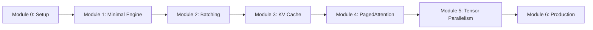

# Building an LLM Inference Engine from Scratch

## 🎯 Course Overview

This comprehensive tutorial series will guide you through building a production-ready LLM inference engine from scratch. By the end of this course, you'll understand the core concepts behind systems like vLLM and be able to implement your own high-performance inference engine.

## 📚 What You'll Learn

- **Core Concepts**: Autoregressive generation, attention mechanisms, and transformer architecture
- **Performance Optimizations**: Batching, KV caching, PagedAttention, and CUDA kernels
- **Production Features**: Multi-GPU support, monitoring, API servers, and deployment
- **Real-World Skills**: Docker containerization, load testing, and cloud deployment

## 🏗️ Course Structure

### Module 0: Environment Setup
- Docker-based development environment
- GPU setup and verification
- Project structure and dependencies
- Running your first inference

### Module 1: Building a Minimal Engine
- Loading pre-trained models
- Basic autoregressive generation
- Tokenization and decoding
- Performance baseline (~20 tokens/sec)

### Module 2: Adding Batching Support
- Dynamic batching implementation
- Handling variable sequence lengths
- Request queuing and scheduling
- 3-4x performance improvement

### Module 3: Implementing KV Cache
- Understanding the KV cache bottleneck
- Basic cache implementation
- Integration with attention layers
- 10-20x performance boost

### Module 4: Memory Management with PagedAttention
- Virtual memory concepts for KV cache
- Block-based allocation
- Prefix caching and sharing
- Copy-on-write semantics

### Module 5: Multi-GPU with Tensor Parallelism
- Distributed computing setup
- Column and row parallelism
- Communication optimization
- Scaling to large models

### Module 6: Production Deployment
- FastAPI server with streaming
- Prometheus monitoring
- Docker and Kubernetes deployment
- Load testing and optimization

## 🛠️ Prerequisites

- **Programming**: Intermediate Python skills
- **Machine Learning**: Basic understanding of transformers and attention
- **Hardware**: NVIDIA GPU with 8GB+ VRAM (or cloud GPU)
- **Software**: Docker installed on your system

## 🚀 Quick Start

1. Clone the repository:
```bash
git clone https://github.com/yourusername/llm-inference-tutorial.git
cd llm-inference-tutorial
```

2. Start the Docker environment:
```bash
docker-compose up -d
docker exec -it llm-tutorial bash
```

3. Run the minimal engine:
```bash
cd /workspace/module-01
python minimal_engine.py
```

## 📈 Learning Path



## 🎓 Learning Approach

Each module follows a consistent structure:

1. **Conceptual Overview**: Understand the problem and solution
2. **Hands-On Implementation**: Build the feature step-by-step
3. **Testing & Verification**: Ensure correctness with tests
4. **Performance Analysis**: Measure and understand improvements
5. **Exercises**: Reinforce learning with challenges

## 📊 Performance Progression

| Module | Feature | Tokens/sec | Improvement |
|--------|---------|------------|-------------|
| 1 | Minimal Engine | ~20 | Baseline |
| 2 | + Batching | ~60 | 3x |
| 3 | + KV Cache | ~600 | 30x |
| 4 | + PagedAttention | ~800 | 40x |
| 5 | + Tensor Parallel | ~1200 | 60x |
| 6 | + Optimizations | ~1400 | 70x |

## 🤝 Community

- **Discord**: Join our community for discussions
- **Issues**: Report bugs or suggest improvements
- **Contributions**: PRs welcome for fixes and enhancements

## 📝 License

This tutorial is released under the MIT License. See LICENSE file for details.

## 🙏 Acknowledgments

This course is inspired by:
- [vLLM](https://github.com/vllm-project/vllm)
- [nano-vLLM](https://github.com/GeeeekExplorer/nano-vllm)
- The broader open-source LLM community

---

Ready to build your own LLM inference engine? Let's start with [Module 0: Environment Setup](./module-00-setup/README.md)!